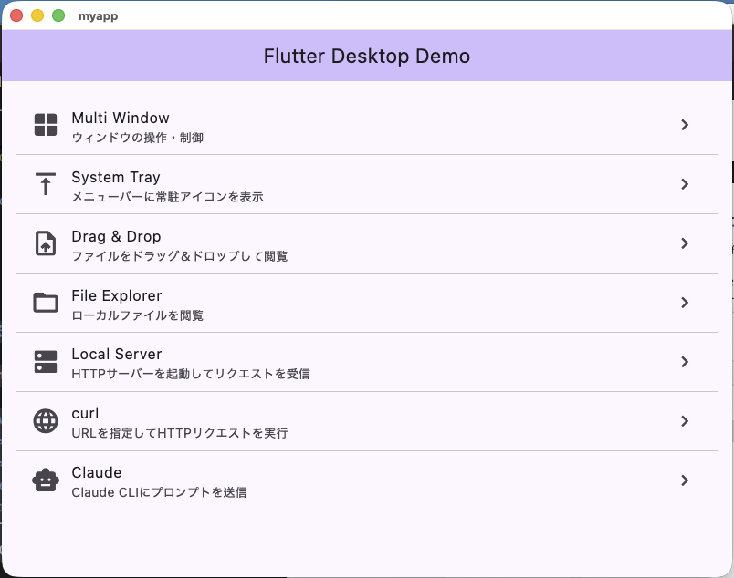
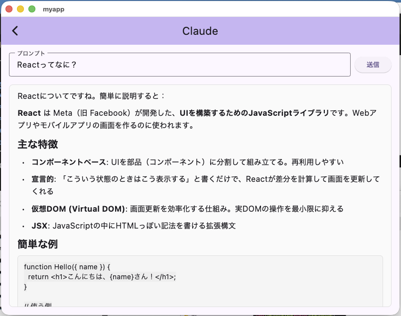

# flutter-desktop-meetup-20260511

Flutter Desktop の探索デモアプリ。ファイル一覧・ウィンドウ操作・コードビューワ・Claude CLI 連携など、デスクトップ環境ならではの API を一通り試したサンプルです。

2026/05/11 開催の勉強会「[AI時代のFlutter開発スペシャル](https://classmethod.connpass.com/event/389468/)」での発表（デモ1）用に作成しました。

## 動作している動画

### デモ動画①  UI・ファイル系（Window / System Tray / Drag & Drop / File Explorer）

https://youtu.be/0UcUY6jr2Lc

### デモ動画②  通信・外部連携系（Local Server / curl / Claude）

https://youtu.be/uy3PfaNYOOg

## スクリーンショット

トップ画面（デモ一覧）



Claude CLI にプロンプトを送信して応答を Markdown 表示



## デモ機能

| # | 機能 | 概要 | 使っているパッケージ |
|---|---|---|---|
| 1 | Window | ウィンドウのサイズ・位置・全画面・常時最前面などを制御 | [window_manager](https://pub.dev/packages/window_manager) |
| 2 | System Tray | メニューバーに常駐アイコンを表示し、コンテキストメニューから操作 | [tray_manager](https://pub.dev/packages/tray_manager) |
| 3 | Drag & Drop | OS からファイルをドラッグ＆ドロップして内容を表示 | [desktop_drop](https://pub.dev/packages/desktop_drop) |
| 4 | File Explorer | ローカルファイルシステムを閲覧、テキストはシンタックスハイライト付きで表示 | `dart:io`, [flutter_highlight](https://pub.dev/packages/flutter_highlight) |
| 5 | Local Server | HTTP サーバーを起動して受信したリクエストをリアルタイム表示 | `dart:io`（`HttpServer`） |
| 6 | curl | URL を指定して HTTP リクエストを実行、レスポンスを表示 | `dart:io`（`HttpClient`） |
| 7 | Claude | Claude Code CLI (`claude`) にプロンプトを送信し、結果を Markdown でレンダリング | `Process.start`, [flutter_markdown_plus](https://pub.dev/packages/flutter_markdown_plus) |

## 動作環境

- macOS（Apple Silicon / Intel）
- Flutter SDK **3.41.5**（`.fvmrc` で固定。[fvm](https://fvm.app/) の利用を推奨）
- Xcode（macOS ビルド用）
- Ruby / Bundler（CocoaPods のセットアップに使用）

Demo 7（Claude）を動かすには [Claude Code CLI](https://docs.claude.com/ja/docs/claude-code/overview) のインストールが必要です。

## セットアップ

```bash
# 1. Flutter SDK を .fvmrc のバージョンで揃える
fvm install
fvm use

# 2. 依存パッケージを取得
fvm flutter pub get

# 3. CocoaPods のセットアップ（macOS ビルドに必要）
bundle install
bundle exec pod install --project-directory=macos
```

## 実行

```bash
fvm flutter run -d macos
```

または VS Code で `Run app (macOS Debug)` 構成を F5。

### 初期表示パスの指定

`--dart-define=INITIAL_PATH=<path>` で File Explorer の初期表示ディレクトリを指定できます（未指定時は `$HOME`）。

```bash
fvm flutter run -d macos --dart-define=INITIAL_PATH=/path/to/dir
```

VS Code から起動する場合は、`.vscode/launch.json` で `${workspaceFolder}` が渡されるので、リポジトリのルートが初期表示になります。

## ビルド（Release）

```bash
fvm flutter build macos --release
```

または VS Code で `build app (macOS Release)` タスクを実行。

## 関連リンク

- 発表ページ: [AI時代のFlutter開発スペシャル](https://classmethod.connpass.com/event/389468/)
- 発表スライド: [Flutterデスクトップアプリで遊んでみたら意外となんでもできた](https://speakerdeck.com/tasukumaedacm/flutter-desukutotupuapurideyou-ndemitarayi-wai-tonandemodekita)
- 解説ブログ: [【AI時代のFlutter開発スペシャル】「Flutter デスクトップアプリで遊んでみたら意外となんでもできた」で発表しました](https://dev.classmethod.jp/articles/playing-with-flutter-desktop-can-do-anything/)

## ライセンス

[MIT License](LICENSE)
